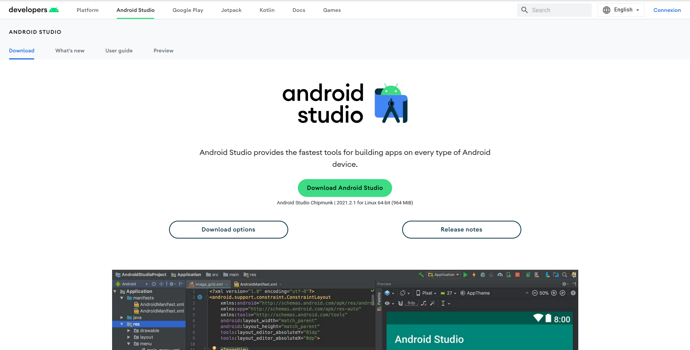
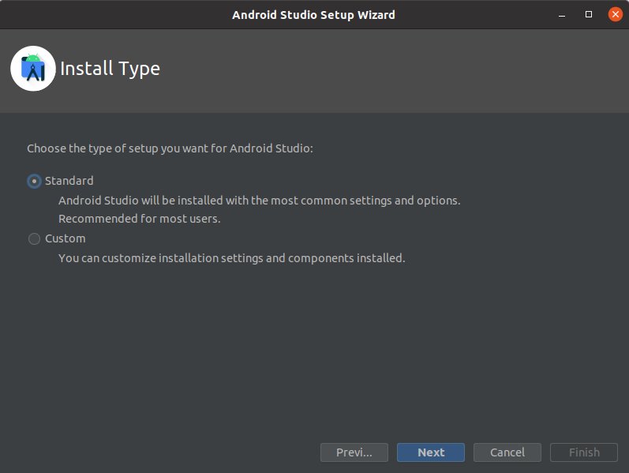
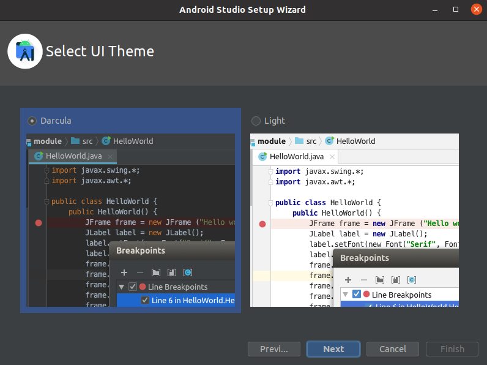
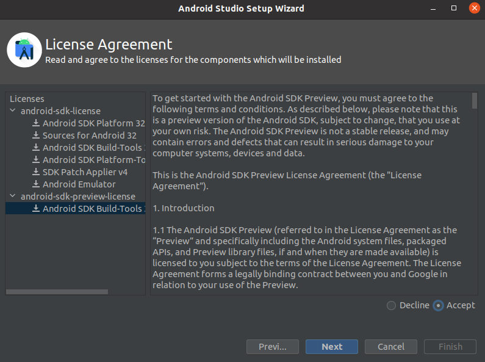
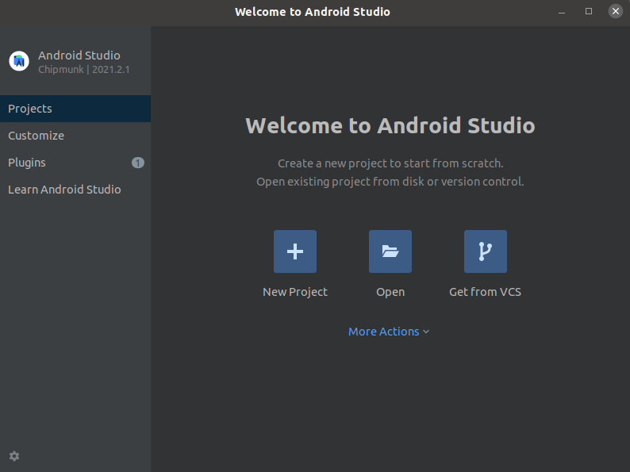

# Car_detection_app

# Documentation Installation Android Studio

<h1 align="center">
 
 

 
 
</h1>

 

Ce ReadMe contient toutes les informations pour :

- Installer Android Studio sur Ubuntu

 

## Réalisé par
 
* **Erwan Lebailly** 

 

Sommaire

- [Dualboot](#Dualboot)
- [Upgrade](#Upgrade)
- [Installations](#Installations)
  - [Docker](#Docker)
  - [v4l2loopback](#v4l2loopback)
  - [SBT](#SBT)
  - [JAVA](#JAVA)
  - [Cuda](#Cuda)
  - [Realsense](#Realsense)
  - [Ros](#Ros)
  - [Jetbrains](#Jetbrains)

---

 
 

# Dualboot
## Installer Ubuntu 20.04 en dual-boot avec Windows 10

 
 

### Étape 1 : faire qqch
 

  * Télécharger Android Studio sur le [site officiel](https://developer.android.com/studio) 

 

  

 

  * Dézipper le fichier à l'endroit où vous souhaitez installer Android Studio
  * Ouvrir un terminal et installer les libraires nécessaires grâce à :
  * - sudo apt-get install libc6:i386 libncurses5:i386 libstdc++6:i386 lib32z1 libbz2-1.0:i386

 

  * Vous pouvez maintenant lancer android studio !
  * Pour cela, dans un terminal : cd android-studio/bin/ puis lancer android studio : ./studio.sh
  * Une fenêtre s'ouvre, victoire ! 
  * Vous pouvez maintenant choisir le mode d'installation standard
 

  

 

  * Ensuite, choisissez le thème darcula (sombre) comme toute personne avec un minimum de style qui se respecte
 

  
  
 

  * Acceptez maintenant les termes et conditions d'android studio sans naturellement les lire, à la manière d'un Kyle
 
 
  
  
 

 * Android Studio va ensuite télécharger quelques fichiers.
 * Une fois cela fait, c'est bon : vous êtes sur Android Studio
 

  
  
 

### Étape 2 : l'étape deux

 

 Ouvrez l’utilitaire Gestion des disques avec un clic droit sur le logo windows en bas à gauche et sélectionnez Gestion des disques

 

 

Repérez la partition Windows (dans 99% des cas, la lettre C: lui est attribuée), faites un clic droit dessus et sélectionnez Réduire le volume.

 

 

 

 Entrez la taille souhaitée pour la partition Ubuntu dans Quantité d’espace à réduire, puis cliquez sur Réduire

 

 

 
 
 
 Au minimum, Ubuntu recommande d’allouer 15 Go d’espace disque. Comme dans notre cas nous allons utilisé Ubuntu comme environement de développement nous alloué 270 Go

 L’unité de configuration est le Mo, 1 Go = 1024 Mo, on saisit dans notre cas 270 x 1024 = 276480 pour avoir 270 Go

 Le disque dur dispose à présent d’un espace non partitionné utilisable pour l’installation d’Ubuntu.
 
 
 

 ### Étape 3 : installation ubuntu

 
 

 * Insérez votre clé USB d’installation d’Ubuntu 20.04 LTS dans votre PC.

 * Redémarrez votre PC
 
 * Lorsque le logo DELL appuyer plusieurs fois sur f12 jusqu'à l'affichage du menu boot

 * Selectionnez la clef usb insérer (dans notre cas UEFI Generic Mass Storage)

 
 

 
   
 
 

Selectionnez la langue pour l'interface d'installation avec les flèches directionels et cliquer sur installer Ubuntu

 
 

 

 
 

Configurer le clavier en francais
 
 
 

  

 

Connectez-vous à une wifi

  Sélectionnez "Installation normale" et "Télécharger les maj pendant l'installation" (si vous vous êtes connecté à internet)
  Puis cocher la case activant l’installation de logiciels tiers

 
 

 
 

Redimensionner les partitions en selectionnant Autre chose

 
 

Faites un clique droit sur l'espace libre qui correspond à l'espace alloué precedemmment et selectionnez ajouter

Nous allons créée trois partitions : 

* Une partition swap (Le swap est une zone du disque dur dédiée à simuler de la mémoire vive lorsque celle-ci peut venir à manquer)

On va lui allouer 8 Go et Selectionnez l'utlisation "swap"

* Une partition / pour les fichiers de configuration d'ubuntu d'environ 1 tier de l'espace alloué

* Une partion /home pour les fichiers de l'utilisateur avec le reste de la mémoire disponible

Configurer ensuite votre nom et votre mot de passe pour terminer l'installation

 # Upgrade
 
 ## Upgrade d'Ubuntu 18.04 en Ubuntu 20.04
